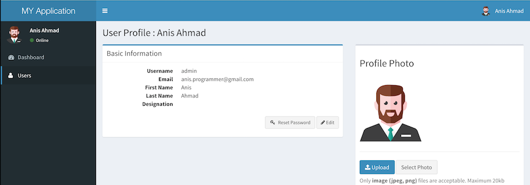

Symfony 2.8 with Admin LTE
==============

A ready made setup to use as boilerplate for **Symfony 2.8** with **Admin LTE 2** admin template

The following things are provided pre-configured - 

* Layout using beautiful, responsive **[Admin LTE 2](https://almsaeedstudio.com/themes/AdminLTE/index.html)** Template 
* Sample working pages (Login, Dashboard and User CRUD) for using Admin LTE 2 design  
* Working User Entity and Login, Logout etc. using **[FOSUserBundle](https://github.com/FriendsOfSymfony/FOSUserBundle)**
* Configured **[SyliusResourceBundle](https://github.com/Sylius/SyliusResourceBundle)**
* Flexible, configurable menu using **[KNPMenuBundle](https://github.com/KnpLabs/KnpMenuBundle)**
* Installation of assets with **[Bower](http://bower.io/)**

Screenshots
----------------





Installation
----------------

1. Clone the repository to your local

    ```
    git clone git@github.com:ajaxray/sf28_lte2.git my-project
    ```

2. Create a VirtualHost:

    ```
    <VirtualHost *:80>

        ServerName my-project.dev

        <Directory "/path/to/my-project/web">
           Options Indexes FollowSymLinks MultiViews
           AllowOverride All
           Order allow,deny
           Allow from all
        </Directory>

        DocumentRoot "/path/to/my-project/web"

    </VirtualHost>
    ```
    
    Don't forget to add domain in `hosts` file and reload apache.
      
3. Create `.htaccess` file and modify to match your environment:

    ```
    cp web/.htaccess.dist web/.htaccess
    ```

5. Download the vendor libraries:

    ```
    composer install --prefer-dist
    bower install
    ```

6. Prepare the database:

    ```
    php app/console doctrine:database:create
    php app/console doctrine:schema:create
    ```

7. Create a super admin to access dashboard:

    ```
    php app/console fos:user:create admin --super-admin
    ```

7. Run the app by visiting: http://my-project.dev

Enjoy!

----

Usages notes
--------------------

**User Creation Strategy :** Users will be created by admin from admin panel. 
Then user will receive a welcome email including a link to reset his password.   